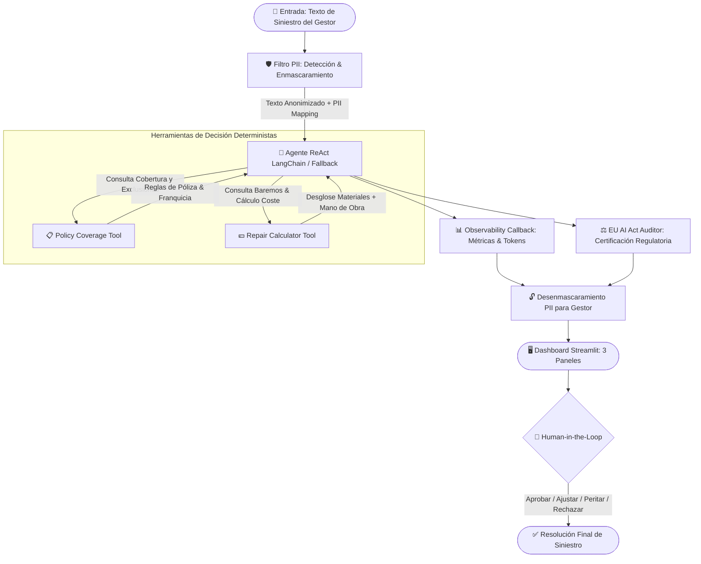

# 🛡️ GuardSeguro AI — Agente Evaluador de Siniestros con Filtros de IA Responsable

[](https://www.python.org/)
[](https://streamlit.io/)
[](https://www.langchain.com/)
[](https://www.docker.com/)
[](https://docs.pydantic.dev/)
[](https://artificialintelligenceact.eu/)
[-brightgreen?style=for-the-badge&logo=pytest&logoColor=white)](https://docs.pytest.org/)

> **Proyecto de demostración técnica y de gobernanza para la posición de Senior AI Engineer (GenAI)**  
> **Centro de Excelencia (CoE) de Automatización e Inteligencia Artificial — Allianz Spain** (Ref. 102972)

---

## 📋 Índice

1. [Resumen Ejecutivo y Propuesta de Valor](#-resumen-ejecutivo-y-propuesta-de-valor)
2. [Arquitectura del Sistema y Clean Design](#-arquitectura-del-sistema-y-clean-design)
3. [Flujo End-to-End del Agente](#-flujo-end-to-end-del-agente)
4. [Módulos Principales](#-módulos-principales)
   - [IA Responsable y Filtro PII (RGPD)](#1-ia-responsable-y-filtro-pii-rgpd)
   - [Herramientas del Agente (Tool Calling)](#2-herramientas-del-agente-tool-calling)
   - [Motor de Agente ReAct & Fallback Determinista](#3-motor-de-agente-react--fallback-determinista)
   - [Observabilidad, Trazabilidad & Métricas LLMOps](#4-observabilidad-trazabilidad--métricas-llmops)
   - [Ficha de Cumplimiento EU AI Act](#5-ficha-de-cumplimiento-eu-ai-act)
   - [Dashboard Interactivo en Streamlit](#6-dashboard-interactivo-en-streamlit)
5. [Guía de Despliegue y Ejecución con Docker](#-guía-de-despliegue-y-ejecución-con-docker)
6. [Guía de Ejecución Local con Python](#-guía-de-ejecución-local-con-python)
7. [Despliegue Cloud (Streamlit Community / Hugging Face / Contenedores)](#-despliegue-cloud-y-llmops)
8. [Matriz de Cumplimiento EU AI Act (Reglamento UE 2024/1689)](#-matriz-de-cumplimiento-eu-ai-act)
9. [Justificación Técnica y Narrativa para Allianz Spain](#-justificación-técnica-para-allianz-spain)
10. [Estructura del Repositorio](#-estructura-del-repositorio)

---

## 🎯 Resumen Ejecutivo y Propuesta de Valor

**GuardSeguro AI** es una solución enterprise que simula el asistente inteligente de un gestor de siniestros de **Allianz Spain**. Resuelve el análisis y dictamen de siniestros complejos combinando **Modelos de Lenguaje (GenAI)**, **Sistemas Basados en Agentes con Invocación de Herramientas (*Tool Calling*)**, un **motor estricto de IA Responsable (Anonimización de PII pre-LLM)** y una **evaluación automática de gobernanza según el EU AI Act**.

### Puntos Fuertes Diferenciales:
* 🔒 **Privacidad Total (Zero PII Leak):** Ningún dato personal identificable (DNI/NIE, matrículas, teléfonos, emails, cuentas bancarias IBAN, direcciones postales o nombres) se envía al LLM externo. Se enmascara localmente mediante expresiones regulares y gazetteers contextuales, y se desenmascara solo al renderizar la decisión final para el gestor humano.
* 🤖 **Agente ReAct con Herramientas Especializadas:** El agente no "alucina" coberturas ni precios; invoca herramientas deterministas de verificación de póliza (`check_policy_coverage`) y baremos técnicos oficiales de reparación de chapa, pintura, lunas y mecánica (`calculate_repair_estimate`).
* 📊 **Observabilidad & LLMOps Integrados:** Captura en tiempo real cada paso de razonamiento (*Thought/Action/Observation*), latencia en segundos, desglose de tokens (*prompt*, *completion*, *total*) y estimación de coste en USD.
* ⚖️ **Alineación con el EU AI Act (Anexo III - Alto Riesgo):** Genera una auditoría regulatoria automática con garantía *Human-in-the-Loop* (el sistema es una propuesta asistencial, la decisión final la toma el gestor), trazabilidad auditable (Art. 12 y 13) y minimización de datos (Art. 10).
* 🧪 **Calidad de Software y Cobertura:** 169 tests unitarios e integrados pasando al 100% en entorno Docker multi-stage optimizado y no-root.

---

## 🏛️ Arquitectura del Sistema y Clean Design

El proyecto sigue una arquitectura modular desacoplada basada en capas de dominio, infraestructura y presentación:

```
┌─────────────────────────────────────────────────────────────────────────┐
│                      PRESENTACIÓN (Streamlit UI)                        │
│               app.py  │  src/ui/components.py  │  src/ui/sample_cases.py │
└────────────────────────────────────┬────────────────────────────────────┘
                                     │
┌────────────────────────────────────▼────────────────────────────────────┐
│                    FILTRO DE IA RESPONSABLE (Privacidad)                │
│             src/privacy/masker.py  │  src/privacy/patterns.py            │
│       (Anonimización regex/gazetteer reversible de PII antes de LLM)    │
└────────────────────────────────────┬────────────────────────────────────┘
                                     │ Texto anonimizado
┌────────────────────────────────────▼────────────────────────────────────┐
│                  ORQUESTACIÓN DEL AGENTE (GenAI ReAct)                  │
│       src/agent/claim_agent.py  │  prompts.py  │  parser.py  │  observability.py │
│                     LangChain Tool-Calling / Offline Fallback           │
└───────────────────────┬─────────────────────────┬───────────────────────┘
                        │                         │
     ┌──────────────────▼──────────┐   ┌──────────▼─────────────────┐
     │  Herramienta de Cobertura   │   │  Herramienta de Estimación │
     │  src/tools/policy_coverage  │   │  src/tools/repair_calculator│
     │  policy_catalog.json        │   │  repair_rates.json         │
     └─────────────────────────────┘   └────────────────────────────┘
                                     │
┌────────────────────────────────────▼────────────────────────────────────┐
│               GOBERNANZA & CUMPLIMIENTO (EU AI Act Auditor)             │
│            src/compliance/auditor.py  │  src/compliance/models.py       │
│             (Anexo III Alto Riesgo, Human Oversight Art. 14, RGPD)       │
└─────────────────────────────────────────────────────────────────────────┘
```

---

## 🔄 Flujo End-to-End del Agente



---

## 📦 Módulos Principales

### 1. IA Responsable y Filtro PII (RGPD)
* **Ubicación:** [`src/privacy/`](src/privacy/)
* **Capacidades:** Detecta y enmascara mediante expresiones regulares y gazetteers contextuales:
  - DNI / NIE españoles con verificación de formato (`[DNI_1]`).
  - Matrículas españolas tanto modernas (`1234-BBB`) como provinciales (`M-1234-AB`) (`[MATRICULA_1]`).
  - Teléfonos móviles y fijos con o sin prefijo internacional `+34` o `0034` (`[TELEFONO_1]`).
  - Direcciones de correo electrónico (`[EMAIL_1]`).
  - Códigos de cuenta bancaria internacional IBAN (`[IBAN_1]`).
  - Direcciones postales de España (`Calle`, `Avenida`, `Paseo`, `C/`, etc.) (`[DIRECCION_1]`).
  - Nombres propios contextuales (`[NOMBRE_1]`).
* **Seguridad:** Encripta y aísla el diccionario de mapeo `pii_mapping`. Los LLMs externos nunca procesan datos reales de clientes.

### 2. Herramientas del Agente (Tool Calling)
* **Ubicación:** [`src/tools/`](src/tools/)
* **`check_policy_coverage`:** Analiza la tipología de daño frente al catálogo oficial de coberturas (`policy_catalog.json`). Detecta coberturas estándar (*Lunas, Granizo, Colisión, Robo, Vandalismo, Asistencia, Agua, Incendio, RC*) y evalúa exclusiones contractuales explícitas (*Desgaste, Alcoholemia, Negligencia grave / Dolo*).
* **`calculate_repair_estimate`:** Módulo determinista que computa horas de taller, mano de obra por zona dañada (*Chapa, Pintura, Luna, Parachoques, Motor, Retrovisores, Faros LED, Fontanería*), materiales y deducción exacta de franquicia asegurada:  
  $$\text{Coste Neto} = \max(0, \text{Coste Bruto} - \text{Franquicia})$$

### 3. Motor de Agente ReAct & Fallback Determinista
* **Ubicación:** [`src/agent/`](src/agent/)
* **Orquestación ReAct:** Implementado con LangChain y soporte para modelos `OpenAI` (`gpt-4o-mini`). Sigue el ciclo formal:
  $$\text{Claim} \rightarrow \text{Thought} \rightarrow \text{Action (Tool)} \rightarrow \text{Observation} \rightarrow \text{Final Answer}$$
* **Zero-Downtime Fallback:** Si no se dispone de `OPENAI_API_KEY` o hay caída de conectividad, el agente conmuta de forma transparente a su motor determinista offline basado en reglas, garantizando que el sistema siempre esté disponible en producción y para testing.

### 4. Observabilidad, Trazabilidad & Métricas LLMOps
* **Ubicación:** [`src/agent/observability.py`](src/agent/observability.py)
* **Trazabilidad Integral:** Captura los *Intermediate Steps* exactos, nombres de herramientas invocadas, argumentos de entrada y respuestas devueltas.
* **Métricas en Tiempo Real:** Latencia de ejecución en segundos, recuento de tokens de entrada/salida y estimación de coste de inferencia.
* **Exportadores:** Generación de trazas en formato JSON estructurado, informe ejecutivo Markdown y diagramas de flujo interactivos Mermaid.

### 5. Ficha de Cumplimiento EU AI Act
* **Ubicación:** [`src/compliance/`](src/compliance/)
* **Clasificación Anexo III:** Justifica y clasifica el sistema como **Alto Riesgo (Punto 5.a)** por evaluar riesgos e indemnizaciones en seguros esenciales.
* **Auditoría de 4 Pilares:**
  1. *Human-in-the-Loop (Art. 14):* Certifica que la IA solo asiste proponiendo resoluciones y no ejecuta pagos de forma autónoma.
  2. *Transparencia y Explicabilidad (Art. 12 & 13):* Proporciona la fundamentación técnica y los logs de razonamiento.
  3. *Privacidad y Calidad de Datos (Art. 10):* Certifica el enmascaramiento previo de PII y cumplimiento del RGPD.
  4. *Robustez Técnica y Seguridad (Art. 15):* Valida el control de excepciones y consistencia del dictamen.

### 6. Dashboard Interactivo en Streamlit
* **Ubicación:** [`app.py`](app.py) y [`src/ui/`](src/ui/)
* **Paleta Corporativa:** Estilo sobrio y profesional adaptado a la identidad visual de Allianz (`#003781`, `#001E50`, `#00A3E0`, `#F4F7FB`).
* **3 Casos Predefinidos en 1 Clic:**
  1. *Caso 1 (Aprobado):* Tormenta y granizo con rotura de lunas (cobertura total sin franquicia).
  2. *Caso 2 (Rechazado):* Avería de embrague por desgaste natural (exclusión contractualmente motivada).
  3. *Caso 3 (Complejo):* Colisión múltiple con terceros, franquicia de 150€ y datos sensibles cruzados.
* **Paneles Simultáneos:** 
  1. Privacidad y Comparador PII.
  2. Resolución y Desglose Financiero con Botones Human-in-the-Loop.
  3. Trazabilidad de Razonamiento, Pasos del Agente y Ficha Regulatoria del EU AI Act con descargas en JSON y Markdown.

---

## 🐳 Guía de Despliegue y Ejecución con Docker

El proyecto cuenta con un entorno contenerizado con mejores prácticas de seguridad (usuario no-root `appuser:appgroup`, imagen base `python:3.11-slim`, healthcheck con `curl`, y layer caching optimizado).

### Requisitos Previos:
* Docker Engine 24+ y Docker Compose v2+

### 1. Clonar el repositorio y configurar variables de entorno:
```bash
git clone https://github.com/tu-usuario/guardseguro-ai.git
cd guardseguro-ai

# Copiar plantilla de variables de entorno
cp .env.example .env
```
*(Opcional)*: Edita `.env` e introduce tu `OPENAI_API_KEY` para activar el LLM de OpenAI. Si se deja en blanco, la aplicación funcionará de forma automática en modo offline determinista.

### 2. Construir e iniciar el contenedor:
```bash
docker compose up --build -d
```

### 3. Verificar el estado del servicio:
```bash
docker compose ps
```

Accede desde tu navegador web a:  
👉 **`http://localhost:8501`**

### 4. Ejecutar la suite completa de tests dentro del contenedor:
```bash
docker compose run --rm --entrypoint pytest guardseguro-ai -v
```

### 5. Ver logs en tiempo real y detener el contenedor:
```bash
# Ver logs del contenedor
docker compose logs -f

# Detener los contenedores
docker compose down
```

---

## 💻 Guía de Ejecución Local con Python

Si prefieres ejecutar la aplicación directamente en tu entorno local sin Docker:

### Requisitos Previos:
* Python 3.11 o superior instalado
* `pip` y entorno virtual `venv`

### 1. Crear y activar el entorno virtual:
```bash
# En macOS / Linux:
python3 -m venv .venv
source .venv/bin/activate

# En Windows (PowerShell):
python -m venv .venv
.venv\Scripts\Activate.ps1
```

### 2. Instalar dependencias:
```bash
pip install --upgrade pip
pip install -r requirements.txt
```

### 3. Configurar variables de entorno:
```bash
cp .env.example .env
```

### 4. Ejecutar la suite de tests unitarios:
```bash
pytest -v
```

### 5. Lanzar el dashboard de Streamlit:
```bash
streamlit run app.py
```

La aplicación se abrirá automáticamente en `http://localhost:8501`.

---

## ☁️ Despliegue Cloud y LLMOps

### Opción 1: Streamlit Community Cloud (Recomendado - 5 minutos)
1. Haz un *fork* o sube este repositorio a tu cuenta de **GitHub**.
2. Entra en [share.streamlit.io](https://share.streamlit.io/) e inicia sesión con tu GitHub.
3. Haz clic en **"New app"**, selecciona el repositorio, rama `main` y archivo principal `app.py`.
4. En **"Advanced settings" -> "Secrets"**, pega las variables de tu archivo `.env`:
   ```toml
   OPENAI_API_KEY = "sk-proj-tu-clave-aqui"
   OPENAI_MODEL_NAME = "gpt-4o-mini"
   OPENAI_TEMPERATURE = 0.0
   APP_ENV = "production"
   ```
5. Haz clic en **"Deploy"**. Tu aplicación estará disponible públicamente con certificado SSL automático.

### Opción 2: Hugging Face Spaces
1. Crea un nuevo Space en [Hugging Face Spaces](https://huggingface.co/spaces).
2. Selecciona **Streamlit** (o **Docker**) como SDK.
3. Conecta tu repositorio de GitHub o sube el código fuente.
4. En **Settings -> Variables and secrets**, define el secreto `OPENAI_API_KEY`.

### Opción 3: Contenedores Cloud (AWS ECS / GCP Cloud Run / Azure Container Apps)
El `Dockerfile` incluye `HEALTHCHECK` y configuración no-root listo para despliegues en orquestadores Kubernetes o contenedores sin servidor en AWS/GCP/Azure.

---

## ⚖️ Matriz de Cumplimiento EU AI Act

| Requisito EU AI Act | Artículo / Anexo | Implementación en GuardSeguro AI | Estado |
|---|---|---|:---:|
| **Clasificación de Riesgo** | Anexo III, Punto 5.a | Categorizado formalmente como **Alto Riesgo** (Evaluación de riesgos y precios de seguros en personas físicas). | ✅ Certificado |
| **Supervisión Humana (*Human-in-the-Loop*)** | Artículo 14 | El agente actúa exclusivamente como motor de recomendación asistencial. La interfaz Streamlit incluye botones obligatorios para que el gestor humano apruebe, modifique o rechace la resolución. | ✅ Certificado |
| **Transparencia y Explicabilidad** | Artículos 12 y 13 | Registro auditable paso a paso (*Thought/Action/Observation*), cálculo de costes desagregado y fundamentación jurídica y técnica en cada dictamen. | ✅ Certificado |
| **Minimización y Calidad de Datos** | Artículo 10 & RGPD | Enmascaramiento reversible y local de todo dato personal (PII) antes de cualquier llamada a LLM externo. | ✅ Certificado |
| **Ciberseguridad y Robustez** | Artículo 15 | Contenedor no-root, inyección segura de secretos por entorno, tipado estricto con Pydantic v2 y fallback determinista offline. | ✅ Certificado |

---

## 💼 Justificación Técnica para Allianz Spain

### Alineación con los requisitos de Senior AI Engineer (GenAI - CoE Automation & AI):

> *"Dominio avanzado de Python y desarrollo de software, diseño de sistemas basados en agentes, gobierno de datos, Responsible AI y despliegue en producción con LLMOps."*

1. **Más allá de un simple Chatbot / Wrapper de API:** GuardSeguro AI no realiza simples llamadas estáticas a un LLM. Diseña un sistema de agentes ReAct que razona, planifica e invoca herramientas especializadas (*Policy Coverage* y *Repair Rates*) mediante contratos de datos fuertemente tipados con Pydantic v2.
2. **Mentalidad Enterprise y Gobernanza Real:** En el sector asegurador, la privacidad y la regulación no son opcionales. La implementación del filtro PII antes del LLM y la auditoría automática según el **EU AI Act** demuestran visión integral de negocio y cumplimiento normativo.
3. **Buenas Prácticas de Ingeniería y LLMOps:** Dockerfile multi-stage seguro, gestión de secretos desacoplada, observabilidad de tokens/costes/latencia, tests unitarios exhaustivos (169 tests con 100% de éxito) y arquitectura limpia y modular.

---

## 📂 Estructura del Repositorio

```text
allianz-python/
├── .dockerignore                 # Exclusiones seguras de construcción Docker
├── .env.example                  # Plantilla de variables de entorno (sin secretos)
├── .gitignore                    # Exclusiones de control de versiones Git
├── .streamlit/
│   └── config.toml               # Configuración y tema visual corporativo Allianz
├── Dockerfile                    # Contenedor multi-stage optimizado y no-root
├── docker-compose.yml            # Orquestador local con healthcheck y volumenes
├── requirements.txt              # Dependencias fijadas y compatibles
├── app.py                        # Punto de entrada de la UI interactiva Streamlit
├── src/                          # Código fuente modular de la aplicación
│   ├── __init__.py
│   ├── core/                     # Núcleo, configuración y modelos Pydantic v2
│   │   ├── config.py             # Settings con validación Pydantic
│   │   └── models.py             # Esquemas de datos fuertemente tipados
│   ├── privacy/                  # Módulo de IA Responsable y Filtro PII
│   │   ├── patterns.py           # Expresiones regulares para DNI, matrículas, IBAN, etc.
│   │   └── masker.py             # Motor reversible de enmascaramiento y desenmascaramiento
│   ├── tools/                    # Herramientas de decisión para el agente
│   │   ├── data/
│   │   │   ├── policy_catalog.json  # Catálogo oficial de pólizas y coberturas
│   │   │   └── repair_rates.json    # Baremos de reparación de materiales y mano de obra
│   │   ├── policy_coverage.py   # Verificación determinista de coberturas y exclusiones
│   │   └── repair_calculator.py # Cálculo exacto de importes y deducción de franquicia
│   ├── agent/                    # Motor de Agente GenAI y Observabilidad
│   │   ├── claim_agent.py        # Orquestador ReAct con LangChain y fallback offline
│   │   ├── prompts.py            # System prompts y plantillas de razonamiento
│   │   ├── parser.py             # Parser estructurado JSON/Pydantic
│   │   └── observability.py      # Callback handler, métricas de tokens, latencia y trazas
│   ├── compliance/               # Motor de Auditoría y Gobernanza EU AI Act
│   │   ├── models.py             # Modelos de reporte regulatorio
│   │   └── auditor.py            # Generador de auditoría y certificación Anexo III
│   └── ui/                       # Componentes de presentación visual
│       ├── components.py         # Paneles de privacidad, dictamen, trazabilidad y AI Act
│       └── sample_cases.py       # Casos de prueba predefinidos representativos
└── tests/                        # Suite de 169 tests unitarios e integrados
    ├── test_config.py
    ├── test_models.py
    ├── test_privacy.py
    ├── test_tools_coverage.py
    ├── test_tools_calculator.py
    ├── test_agent.py
    ├── test_observability.py
    ├── test_compliance.py
    └── test_ui_cases.py
```

---

## 📄 Licencia

Este proyecto ha sido desarrollado como demostración técnica de alta fidelidad para el proceso de selección de **Allianz Spain** (CoE Automation & AI). Todos los derechos reservados.
