# Product Backlog & User Stories — GuardSeguro AI

> **Proyecto**: GuardSeguro AI – Agente Evaluador de Siniestros con Filtros de IA Responsable  
> **Organización**: Allianz Spain (CoE Automation & AI)  
> **Rol de Gestión**: Senior Technical Project Manager (AI / GenAI)  
> **Metodología**: Agile / Scrum — Enfoque Modular, Incremental y Desacoplado  

---

## 🗺️ Roadmap de Ejecución por Fases

```mermaid
gantt
    title Roadmap de Implementación - GuardSeguro AI
    dateFormat  X
    axisFormat %d
    section Épica 0: Cimientos
    US-01: Configuración de Entorno, Docker & Seguridad :0, 1
    US-02: Modelos de Datos & Estructuras Base   :1, 2
    section Épica 1: IA Responsable
    US-03: Módulo de Enmascaramiento PII         :2, 4
    section Épica 2: Herramientas de Negocio
    US-04: Herramienta de Coberturas             :3, 5
    US-05: Herramienta de Cálculo de Daños       :4, 6
    section Épica 3: Agente GenAI
    US-06: Agente ReAct con Tool Calling        :6, 8
    US-07: Trazabilidad y Logs de Auditoría      :7, 9
    section Épica 4: Regulación
    US-08: Ficha de Cumplimiento EU AI Act       :8, 10
    section Épica 5: UI y Producción
    US-09: Dashboard Web en Streamlit           :9, 11
    US-10: Contenerización Docker, Despliegue Cloud & LLMOps :10, 12
```



---

## 🏛️ ÉPICA 0: Cimientos del Proyecto y Arquitectura Base
*Objetivo: Disponer de una base de código limpia, modular, segura, contenerizada con Docker y con las dependencias necesarias antes de escribir lógica de negocio.*

---

### **US-01: Inicialización del Entorno, Dockerización y Gestión de Secretos**
* **Como:** Ingeniero de Software / DevOps de Allianz.
* **Quiero:** Configurar la estructura de carpetas del proyecto, entorno virtual de Python, `Dockerfile`, `docker-compose.yml`, `.dockerignore`, `requirements.txt` y gestión segura de variables de entorno (`.env`).
* **Para:** Garantizar un desarrollo modular, reproducible, aislado mediante contenedores Docker y que ninguna clave de API quede expuesta en el control de versiones.

#### Criterios de Aceptación (DoD):
- [x] Estructura de directorios creada:
  ```text
  guardseguro-ai/
  ├── src/
  │   ├── core/         # Configuración y utilidades
  │   ├── privacy/      # Módulo PII / Responsible AI
  │   ├── tools/        # Herramientas de póliza y cálculo
  │   ├── agent/        # Orquestación del LLM
  │   └── compliance/   # Normativa EU AI Act
  ├── app.py            # Entrypoint de Streamlit
  ├── Dockerfile        # Imagen Docker optimizada (python:3.11-slim, usuario no-root)
  ├── docker-compose.yml # Orquestación local y binding de variables
  ├── .dockerignore     # Exclusión de archivos innecesarios del contexto Docker
  ├── requirements.txt
  ├── .env.example
  └── .gitignore
  ```
- [x] Archivo `.gitignore` configurado para ignorar `.env`, `__pycache__` y entornos virtuales.
- [x] Archivo `.dockerignore` configurado para excluir `.git`, `.venv`, `__pycache__`, `.env` y archivos temporales del build.
- [x] Archivo `Dockerfile` funcional y optimizado para la ejecución de Streamlit (puerto `8501`, healthcheck, buenas prácticas de capas y seguridad).
- [x] Archivo `docker-compose.yml` que permita levantar el servicio con `docker compose up` mapeando puertos y variables de entorno desde `.env`.
- [x] `requirements.txt` con versiones bloqueadas (`streamlit`, `langchain`, `langchain-openai`, `python-dotenv`, `pydantic`).

---

### **US-02: Definición de Modelos de Datos e Interfaces Base**
* **Como:** Desarrollador del sistema.
* **Quiero:** Crear esquemas de datos tipados (usando Pydantic o dataclasses de Python) para representar un Siniestro, una Póliza y la Resolución Final.
* **Para:** Asegurar contratos de datos estrictos y tipados entre todos los módulos independientes.

#### Criterios de Aceptación (DoD):
- [x] Esquema `ClaimInput` definido (texto original, ID del siniestro, fecha).
- [x] Esquema `AnonymizedClaim` definido (texto procesado, mapeo de tokens enmascarados).
- [x] Esquema `ClaimAssessment` definido (estado de cobertura: *Aprobado/Denegado/Requiere Peritaje*, desglose de costes, franquicia, razonamiento).

---

## 🛡️ ÉPICA 1: Gobernanza y Privacidad (Responsible AI)
*Objetivo: Blindar la privacidad del cliente antes de cualquier llamada a modelos externos.*

---

### **US-03: Módulo de Detección y Enmascaramiento de PII**
* **Como:** Responsable de Privacidad y Cumplimiento RGPD de Allianz.
* **Quiero:** Un módulo en Python que identifique y reemplace datos personales (nombres, DNI/NIE, matrículas, teléfonos, emails, direcciones) por pseudónimos (`[PERSONA_1]`, `[DNI_1]`).
* **Para:** Evitar que datos sensibles salgan del perímetro seguro antes de invocar cualquier LLM comercial.

#### Criterios de Aceptación (DoD):
- [x] Función `mask_pii(text: str) -> (masked_text: str, pii_mapping: dict)`.
- [x] Capacidad de anonimizar al menos: DNI español, teléfonos móviles/fijos, matrículas y nombres propios.
- [x] Función complementaria `unmask_pii(text: str, pii_mapping: dict) -> str` para restaurar los datos en la respuesta final que lee el gestor humano.
- [x] Tests unitarios con al menos 5 ejemplos de reclamaciones reales.

---

## ⚙️ ÉPICA 2: Herramientas Deterministas de Negocio
*Objetivo: Crear las funciones lógicas de cálculo y consulta que el agente usará como "calculadora" y "base de datos".*

---

### **US-04: Herramienta de Verificación de Coberturas de Póliza**
* **Como:** Gestor de Siniestros.
* **Quiero:** Una herramienta de consulta (`check_policy_coverage`) que determine si un tipo de incidente está cubierto por la póliza tipo de Allianz Auto/Hogar.
* **Para:** Que el agente pueda dictaminar objetivamente si el daño reportado tiene cobertura contratada.

#### Criterios de Aceptación (DoD):
- [x] Catálogo de coberturas estructurado en JSON (ej. Fenómenos atmosféricos, Granizo, Rotura de lunas, Colisión, Robo, Vandalismo).
- [x] Función Python decorada como Tool (`@tool`) que recibe el tipo de daño y devuelve un JSON con: `{cubierto: bool, condiciones: str, franquicia_estandar: float}`.
- [x] Manejo de casos de siniestros no cubiertos o dudosos con retorno explicativo.

---

### **US-05: Herramienta de Estimación Económica y Baremos de Reparación**
* **Como:** Perito / Evaluador de Allianz.
* **Quiero:** Una herramienta de cálculo (`calculate_repair_estimate`) que calcule el coste de materiales y mano de obra según la pieza afectada y el nivel de gravedad.
* **Para:** Obtener una estimación matemática exacta y sin alucinaciones del coste del siniestro.

#### Criterios de Aceptación (DoD):
- [x] Tabla de baremos con costes por zona dañada (chapa, pintura, luna delantera, parachoques, motor) y nivel de gravedad (*Leve, Moderado, Grave*).
- [x] Función Python `@tool` que calcule: `Coste Total = Materiales + Mano de Obra - Franquicia`.
- [x] Retorno estructurado con desglose numérico exacto.

---

## 🤖 ÉPICA 3: Orquestación del Agente Inteligente (GenAI)
*Objetivo: Integrar el LLM con capacidad de razonamiento y uso autónomo de las herramientas creadas.*

---

### **US-06: Agente ReAct con Capacidad de Tool-Calling**
* **Como:** Gestor de Siniestros.
* **Quiero:** Que un agente LLM analice la reclamación anonimizada, decida qué herramientas invocar secuencialmente y genere una propuesta de dictamen.
* **Para:** Reducir el tiempo medio de tramitación de siniestros de horas a segundos.

#### Criterios de Aceptación (DoD):
- [x] Agente configurado con LangChain (`create_tool_calling_agent`) o `smolagents` conectado al modelo `gpt-4o-mini`.
- [x] Prompt del sistema con rol explícito: *Asistente de evaluación de siniestros para Allianz Spain*.
- [x] El agente invoca primero la verificación de cobertura; si está cubierto, invoca la estimación económica; finalmente sintetiza el dictamen.
- [x] Salida estructurada garantizada en formato JSON/Pydantic.

---

### **US-07: Trazabilidad, Observabilidad y Registro de Razonamiento**
* **Como:** Auditor de IA de Allianz.
* **Quiero:** Registrar y visualizar el flujo de pensamiento (*Thought/Action/Observation*) y métricas de consumo (tokens, tiempo de respuesta).
* **Para:** Garantizar que el sistema no es una "caja negra" y permite auditar cada decisión tomada.

#### Criterios de Aceptación (DoD):
- [x] Captura de los pasos intermedios (*Intermediate Steps*) del agente.
- [x] Registro de qué herramientas se llamaron y con qué parámetros exactos.
- [x] Métricas calculadas: tiempo de ejecución en segundos y tokens consumidos.


---

## ⚖️ ÉPICA 4: Gobernanza y Cumplimiento Normativo (EU AI Act)
*Objetivo: Demostrar cumplimiento riguroso con la regulación europea de Inteligencia Artificial.*

---

### **US-08: Ficha de Auditoría y Cumplimiento EU AI Act**
* **Como:** Delegado de Cumplimiento Regulatorio (*Compliance Officer*).
* **Quiero:** Un módulo que evalúe y certifique que el sistema opera bajo los estándares del EU AI Act.
* **Para:** Garantizar que la solución cumple con los requisitos para sistemas de IA de **Alto Riesgo** en el sector asegurador.

#### Criterios de Aceptación (DoD):
- [ ] Generación automática de la ficha técnica de cumplimiento:
  - **Clasificación de Riesgo:** Justificación según Anexo III del EU AI Act.
  - **Human-in-the-Loop:** Garantía de que la decisión del agente es una *propuesta* sujeta a validación del gestor humano.
  - **Transparencia y Explicabilidad:** Justificación basada en los logs de la US-07.
  - **Calidad de Datos y Privacidad:** Acreditación mediante el filtro PII de la US-03.

---

## 🖥️ ÉPICA 5: Experiencia de Usuario y Despliegue (UI & LLMOps)
*Objetivo: Empaquetar todo en una aplicación web interactiva, contenerizada en Docker y publicarla en la nube.*

---

### **US-09: Dashboard Interactivo en Streamlit**
* **Como:** Evaluador técnico o de negocio en una entrevista con Allianz.
* **Quiero:** Una interfaz web intuitiva donde pueda probar siniestros con ejemplos predefinidos en un clic y ver el flujo en tiempo real.
* **Para:** Experimentar de forma visual e inmediata la potencia y robustez del sistema.

#### Criterios de Aceptación (DoD):
- [ ] Selector con 3 casos de prueba predefinidos (ej: *Tormenta con cobertura*, *Daño no cubierto*, *Caso complejo con terceros*).
- [ ] Vista en 3 paneles/columnas:
  1. **Privacidad:** Comparador antes/después del enmascaramiento PII.
  2. **Resolución:** Tarjeta con dictamen, importes y recomendación.
  3. **Trazabilidad y AI Act:** Pestaña desplegable con el árbol de decisiones y la ficha regulatoria.

---

### **US-10: Contenerización Docker, Despliegue Cloud & LLMOps**
* **Como:** Reclutador / Responsable del CoE de Allianz / Ingeniero de Operaciones.
* **Quiero:** Ejecutar la aplicación en contenedores Docker (localmente con `docker compose up` o en la nube) y acceder a la aplicación desplegada con un `README.md` profesional.
* **Para:** Validar la capacidad de despliegue en producción, reproducibilidad del entorno, portabilidad y buenas prácticas de ingeniería de software y LLMOps.

#### Criterios de Aceptación (DoD):
- [ ] Imagen Docker testeada y ejecutable localmente mediante `docker compose up --build`.
- [ ] Aplicación desplegada en Streamlit Community Cloud, Hugging Face Spaces o plataforma basada en contenedores.
- [ ] Secretos (`OPENAI_API_KEY`) gestionados de forma segura mediante inyección en `.env` / consola de la nube (sin hardcodear en el repositorio ni en la imagen Docker).
- [ ] `README.md` completo con: Arquitectura, Diagrama de Flujo, Guía de despliegue y ejecución con Docker, Guía de ejecución manual en Python y Justificación técnica para Allianz.

---

## 📊 Matriz de Dependencias y Complejidad

| Épica | User Stories | Dependencias Previas | Complejidad Estimada |
|---|---|---|---|
| **0. Cimientos** | US-01 (Docker + Config), US-02 | Ninguna | 🟢 Baja (1-2 h) |
| **1. IA Responsable** | US-03 | US-01, US-02 | 🟡 Media (2-3 h) |
| **2. Herramientas** | US-04, US-05 | US-01, US-02 | 🟢 Baja (1-2 h) |
| **3. Agente GenAI** | US-06, US-07 | US-03, US-04, US-05 | 🟡 Media (3-4 h) |
| **4. Cumplimiento** | US-08 | US-06, US-07 | 🟢 Baja (1 h) |
| **5. UI & Cloud** | US-09, US-10 (Docker + Cloud) | US-06, US-08 | 🟢 Baja (2 h) |
