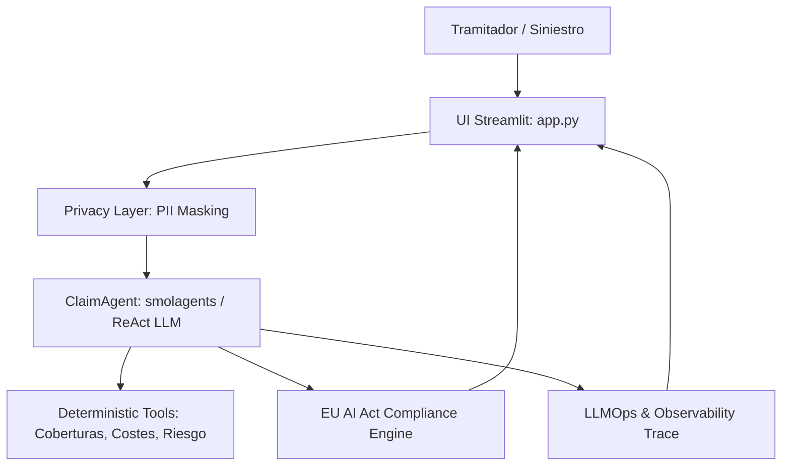

# GuardSeguro AI — Resumen del Proyecto y Arquitectura Técnica
## Aplicación para la vacante de Senior AI Engineer (GenAI) — Allianz Spain (CoE Automation & AI)

Este documento detalla la arquitectura técnica, estructura de código y propuesta de valor de **GuardSeguro AI**, correlacionando cada módulo del repositorio con los requisitos y responsabilidades de la posición descrita en [vacancy.md](vacancy.md).

---

## 1. Narrativa Ejecutiva y Propósito

> **GuardSeguro AI** es un sistema agentic autónomo de evaluación, peritaje y liquidación de siniestros (Autos / Hogar) diseñado para acelerar la tramitación y mitigar el riesgo de fraude. Su arquitectura integra **privacidad por diseño (GDPR / PII)** y gobernanza estricta alineada con el marco regulatorio del **EU AI Act**.

---

## 2. Diagrama de Arquitectura de la Solución

---

## 3. Mapeo Módulo a Módulo vs Requisitos de la Vacante

### A. Arquitectura de Agentes y GenAI
*Requisitos vacante: Diseñar sistemas basados en agentes, frameworks agentic, orquestación de LLMs y razonamiento paso a paso.*

* **[src/agent/claim_agent.py](src/agent/claim_agent.py)**: Orquestador principal del agente pericial. Soporta ejecución mediante LLM (OpenAI GPT-4o-mini / Hugging Face) aplicando patrones ReAct / CoT con fallback automático a motor determinista en caso de indisponibilidad o timeout de APIs externas.
* **[src/agent/prompts.py](src/agent/prompts.py)**: System prompts con ingeniería de contexto avanzada que guían la llamada a herramientas especializadas y garantizan salidas estructuradas.
* **[src/agent/parser.py](src/agent/parser.py)**: Parser resiliente de respuestas del agente, extracción de bloques JSON y mapeo directo a modelos Pydantic con tratamiento defensivo de errores.

---

### B. Herramientas de Negocio y Lógica Aseguradora
*Requisitos vacante: Traducir necesidades de negocio en soluciones técnicas, fiabilidad matemática y automatización CoE.*

* **[src/tools/policy_coverage.py](src/tools/policy_coverage.py)**: Verificación algorítmica de coberturas aseguradas según el tipo de póliza (Terceros, Todo Riesgo con/sin franquicia, Hogar básico/completo).
* **[src/tools/repair_calculator.py](src/tools/repair_calculator.py)**: Cálculo determinista y exacto de costes de reparación, aplicación de franquicias, depreciación y desglose de mano de obra y piezas (elimina alucinaciones numéricas del LLM).
* **[src/tools/risk_assessor.py](src/tools/risk_assessor.py)**: Matriz de scoring de riesgo, detección de patrones de fraude o inconsistencias en la declaración del siniestro.
* **[src/tools/data/policies.json](src/tools/data/policies.json)** y **[src/tools/data/repair_costs.json](src/tools/data/repair_costs.json)**: Catálogos estructurados de baremos de reparación y condiciones de pólizas.

---

### C. Responsible AI, Privacidad y Regulación (EU AI Act)
*Requisitos vacante: Cumplimiento regulatorio (AI Act), seguridad, privacidad y principios de Responsible AI.*

* **[src/privacy/masker.py](src/privacy/masker.py)**: Interceptor de privacidad que anonimiza y pseudonimiza datos sensibles (DNI/NIE, matrículas, IBANs, tarjetas de crédito, nombres, teléfonos) antes de enviar cualquier texto a APIs externas.
* **[src/privacy/patterns.py](src/privacy/patterns.py)**: Catálogo de expresiones regulares y validadores algorítmicos para entidades sensibles según el estándar español y europeo.
* **[src/compliance/auditor.py](src/compliance/auditor.py)**: Motor de auditoría automatizada bajo el **EU AI Act** (clasificación de nivel de riesgo del sistema, detección de variables protegidas/sesgos, mitigación de alucinaciones y mecanismos de control Human-in-the-Loop).
* **[src/compliance/models.py](src/compliance/models.py)**: Esquemas de datos para trazabilidad regulatoria y reportes de auditoría.

---

### D. Modelado de Datos y Arquitectura de Software
*Requisitos vacante: Dominio avanzado de Python, arquitectura limpia y tipado estricto.*

* **[src/core/models.py](src/core/models.py)**: Modelos de dominio con **Pydantic v2** (`ClaimInput`, `ClaimEvaluation`, `DamageItem`, `CostBreakdown`, etc.) asegurando validación estricta en tiempo de ejecución.
* **[src/core/config.py](src/core/config.py)**: Gestión centralizada y tipada de configuración y variables de entorno (`pydantic-settings`).

---

### E. LLMOps, Observabilidad y Operación Productiva
*Requisitos vacante: Entornos LLMOps, escalabilidad, trazabilidad y soluciones preparadas para producción.*

* **[src/agent/observability.py](src/agent/observability.py)**: Sistema de observabilidad estructurado que registra cada paso de ejecución, tokens consumidos, latencia por herramienta, coste estimado y trazas de auditoría exportables.
* **[Dockerfile](Dockerfile)** y **[docker-compose.yml](docker-compose.yml)**: Empaquetado contenerizado siguiendo buenas prácticas de seguridad (usuario no-root, variables de entorno aisladas y despliegue reproducible).
* **[requirements.txt](requirements.txt)**: Gestión de dependencias limpias y fijadas.

---

### F. Frontend Interactivo y Aceleración de Negocio
*Requisitos vacante: Productos de IA escalables, intuitivos y aceleración de adopción en la organización.*

* **[app.py](app.py)**: Entrada principal de la interfaz web con **Streamlit**.
* **[src/ui/components.py](src/ui/components.py)**: Componentes modulares que permiten al tramitador inspeccionar:
  1. Comparativa de texto original vs enmascarado (Privacy Filter).
  2. Trazabilidad paso a paso de las herramientas invocadas por el agente.
  3. Desglose económico detallado de la indemnización.
  4. Panel de cumplimiento del EU AI Act y exportación del expediente en formato JSON.
* **[src/ui/sample_cases.py](src/ui/sample_cases.py)**: Batería de siniestros preconfigurados con diferentes complejidades para demostración.

---

### G. Suite de Calidad y Pruebas Automatizadas
*Requisitos vacante: Estándares de calidad de software y robustez en soluciones críticas.*

* **[tests/test_agent.py](tests/test_agent.py)**: Tests de integración del flujo del agente y fallback determinista.
* **[tests/test_privacy.py](tests/test_privacy.py)**: Cobertura total de detección y anonimización de PII.
* **[tests/test_compliance.py](tests/test_compliance.py)**: Pruebas unitarias de auditoría EU AI Act y control de sesgos.
* **[tests/test_tools_calculator.py](tests/test_tools_calculator.py)**, **[tests/test_tools_coverage.py](tests/test_tools_coverage.py)**, **[tests/test_tools_risk.py](tests/test_tools_risk.py)**: Verificación de precisión en cálculos matemáticos y reglas de negocio.
* **[tests/test_observability.py](tests/test_observability.py)** y **[tests/test_models.py](tests/test_models.py)**: Pruebas de contratos de datos y métricas de ejecución.

---

## 4. Pilares Diferenciales para Defender en Entrevista

1. **Separación de Capas**: Desacoplamiento total entre la lógica del agente, las herramientas de cálculo deterministas, los filtros de privacidad y la capa de presentación.
2. **Eliminación de Alucinaciones en Cálculos**: El LLM actúa como razonador y extractor contextual, pero todos los importes, franquicias y coberturas son procesados por herramientas matemáticas puras.
3. **Privacidad por Diseño (Privacy by Design)**: Ningún dato de carácter personal sale hacia la API de OpenAI/Hugging Face sin haber sido previamente enmascarado.
4. **Cumplimiento Nativo del EU AI Act**: El sistema incorpora un módulo nativo de auditoría con clasificación de riesgo, validación de sesgos y salvaguarda Human-in-the-Loop.
